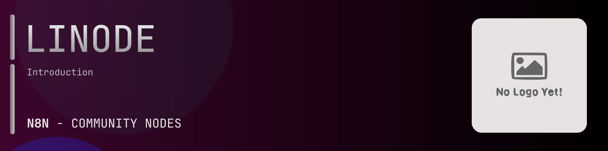

# @n8n-dev/n8n-nodes-linode



[](https://www.npmjs.com/package/@n8n-dev/n8n-nodes-linode)
[](https://opensource.org/licenses/MIT)

---

**Stop writing linode API integrations by hand.**

Every time you connect n8n to linode, you waste hours mapping endpoints, defining parameters, and debugging schemas. You copy-paste from docs, fix edge cases, and pray nothing breaks.

**What if connecting n8n to linode took 5 minutes, not half a day?**

This node gives you **19+ resources** out of the box: **Account**, **Account**, **Databases**, **Domains**, **Images**, and 14 more: with full CRUD operations, typed parameters, and zero manual configuration.

---

## What You Get

- **Zero boilerplate**: Resources, operations, and fields are pre-configured and ready to use
- **Full CRUD**: Create, read, update, and delete support where the API allows it
- **Typed parameters**: No more guessing field types
- **Built-in auth**: API key authentication, ready to go
- **Declarative**: Native n8n performance, no custom execute() overhead

---

## Install

```bash
npm install @n8n-dev/n8n-nodes-linode
```

**Or in n8n:**
1. **Settings → Community Nodes → Install**
2. Search: `@n8n-dev/n8n-nodes-linode`
3. Click **Install**

---

## Quick Start

1. Install the node (above)
2. Add credentials: **linode API** → paste your API key
3. Drag the **linode** node into your workflow
4. Pick a resource → pick an operation → done.

That's it. No configuration files. No code. It just works.

---

## Resources

<details>
<summary><b>Account</b> (47 operations)</summary>

- Get Account View
- Put Account Update
- Post Account Cancel
- Get Events List
- Get Event View
- Post Event Mark as Read
- Post Event Mark as Seen
- Get Invoices List
- Get Invoice View
- Get Invoice Items List
- Get User Logins List All
- Get Login View
- Get Maintenance List
- Get Notifications List
- Get OAUTH Clients List
- Post OAUTH Client Create
- Delete OAUTH Client Delete
- Get OAUTH Client View
- Put OAUTH Client Update
- Post OAUTH Client Secret Reset
- Get OAUTH Client Thumbnail View
- Put OAUTH Client Thumbnail Update
- Get Payment Methods List
- Post Payment Method Add
- Delete Payment Method Delete
- Get Payment Method View
- Post Payment Method Make Default
- Get Payments List
- Post Payment Make
- Get Payment View
- Post Promo Credit Add
- Get Service Transfers List
- Post Service Transfer Create
- Delete Service Transfer Cancel
- Get Service Transfer View
- Post Service Transfer Accept
- Get Account Settings View
- Put Account Settings Update
- Post Linode Managed Enable
- Get Network Utilization View
- Get Users List
- Post User Create
- Delete User Delete
- Get User View
- Put User Update
- Get User s Grants View
- Put User s Grants Update

</details>

<details>
<summary><b>Account</b> (47 operations)</summary>

- Get Account View
- Put Account Update
- Post Account Cancel
- Get Events List
- Get Event View
- Post Event Mark as Read
- Post Event Mark as Seen
- Get Invoices List
- Get Invoice View
- Get Invoice Items List
- Get User Logins List All
- Get Login View
- Get Maintenance List
- Get Notifications List
- Get OAUTH Clients List
- Post OAUTH Client Create
- Delete OAUTH Client Delete
- Get OAUTH Client View
- Put OAUTH Client Update
- Post OAUTH Client Secret Reset
- Get OAUTH Client Thumbnail View
- Put OAUTH Client Thumbnail Update
- Get Payment Methods List
- Post Payment Method Add
- Delete Payment Method Delete
- Get Payment Method View
- Post Payment Method Make Default
- Get Payments List
- Post Payment Make
- Get Payment View
- Post Promo Credit Add
- Get Service Transfers List
- Post Service Transfer Create
- Delete Service Transfer Cancel
- Get Service Transfer View
- Post Service Transfer Accept
- Get Account Settings View
- Put Account Settings Update
- Post Linode Managed Enable
- Get Network Utilization View
- Get Users List
- Post User Create
- Delete User Delete
- Get User View
- Put User Update
- Get User s Grants View
- Put User s Grants Update

</details>

<details>
<summary><b>Databases</b> (46 operations)</summary>

- Get Managed Database Engines List
- Get Managed Database Engine View
- Get Managed Databases List All
- Get Managed MongoDB Databases List
- Delete Managed MongoDB Database Delete
- Get Managed MongoDB Database View
- Put Managed MongoDB Database Update
- Get Managed MongoDB Database Backups List
- Post Managed MongoDB Database Backup Snapshot Create
- Delete Managed MongoDB Database Backup Delete
- Get Managed MongoDB Database Backup View
- Post Managed MongoDB Database Backup Restore
- Get Managed MongoDB Database Credentials View
- Post Managed MongoDB Database Credentials Reset
- Post Managed MongoDB Database Patch
- Get Managed MongoDB Database SSL Certificate View
- Get Managed MySQL Databases List
- Post Managed MySQL Database Create
- Delete Managed MySQL Database Delete
- Get Managed MySQL Database View
- Put Managed MySQL Database Update
- Get Managed MySQL Database Backups List
- Post Managed MySQL Database Backup Snapshot Create
- Delete Managed MySQL Database Backup Delete
- Get Managed MySQL Database Backup View
- Post Managed MySQL Database Backup Restore
- Get Managed MySQL Database Credentials View
- Post Managed MySQL Database Credentials Reset
- Post Managed MySQL Database Patch
- Get Managed MySQL Database SSL Certificate View
- Get Managed PostgreSQL Databases List
- Post Managed PostgreSQL Database Create
- Delete Managed PostgreSQL Database Delete
- Get Managed PostgreSQL Database View
- Put Managed PostgreSQL Database Update
- Get Managed PostgreSQL Database Backups List
- Post Managed PostgreSQL Database Backup Snapshot Create
- Delete Managed PostgreSQL Database Backup Delete
- Get Managed PostgreSQL Database Backup View
- Post Managed PostgreSQL Database Backup Restore
- Get Managed PostgreSQL Database Credentials View
- Post Managed PostgreSQL Database Credentials Reset
- Post Managed PostgreSQL Database Patch
- Get Managed PostgreSQL Database SSL Certificate View
- Get Managed Database Types List
- Get Managed Database Type View

</details>

<details>
<summary><b>Domains</b> (13 operations)</summary>

- Get Domains List
- Post Domain Create
- Post Domain Import
- Delete Domain Delete
- Get Domain View
- Put Domain Update
- Post Domain Clone
- Get Domain Records List
- Post Domain Record Create
- Delete Domain Record Delete
- Get Domain Record View
- Put Domain Record Update
- Get Domain Zone File View

</details>

<details>
<summary><b>Images</b> (6 operations)</summary>

- Get Images List
- Post Image Create
- Post Image Upload
- Delete Image Delete
- Get Image View
- Put Image Update

</details>

<details>
<summary><b>Linode Instances</b> (48 operations)</summary>

- Get Linodes List
- Post Linode Create
- Delete Linode Delete
- Get Linode View
- Put Linode Update
- Get Backups List
- Post Snapshot Create
- Post Backups Cancel
- Post Backups Enable
- Get Backup View
- Post Backup Restore
- Post Linode Boot
- Post Linode Clone
- Get Configuration Profiles List
- Post Configuration Profile Create
- Delete Configuration Profile Delete
- Get Configuration Profile View
- Put Configuration Profile Update
- Get Disks List
- Post Disk Create
- Delete Disk Delete
- Get Disk View
- Put Disk Update
- Post Disk Clone
- Post Disk Root Password Reset
- Post Disk Resize
- Get Firewalls List
- Get Networking Information List
- Post IPv4 Address Allocate
- Delete IPv4 Address Delete
- Get IP Address View
- Put IP Address Update
- Post DC Migration Pending Host Migration Initiate
- Post Linode Upgrade
- Get Linode NodeBalancers View
- Post Linode Root Password Reset
- Post Linode Reboot
- Post Linode Rebuild
- Post Linode Boot into Rescue Mode
- Post Linode Resize
- Post Linode Shut Down
- Get Linode Statistics View
- Get Statistics View year month
- Get Network Transfer View
- Get Network Transfer View year month
- Get Linode s Volumes List
- Get Kernels List
- Get Kernel View

</details>

<details>
<summary><b>Linode Types</b> (2 operations)</summary>

- Get Types List
- Get Type View

</details>

<details>
<summary><b>Linode Kubernetes Engine LKE</b> (23 operations)</summary>

- Get Kubernetes Clusters List
- Post Kubernetes Cluster Create
- Delete Kubernetes Cluster Delete
- Get Kubernetes Cluster View
- Put Kubernetes Cluster Update
- Get Kubernetes API Endpoints List
- Get Kubernetes Cluster Dashboard URL View
- Delete Kubeconfig Delete
- Get Kubeconfig View
- Delete Node Delete
- Get Node View
- Post Node Recycle
- Get Node Pools List
- Post Node Pool Create
- Delete Node Pool Delete
- Get Node Pool View
- Put Node Pool Update
- Post Node Pool Recycle
- Post Cluster Nodes Recycle
- Post Kubernetes Cluster Regenerate
- Delete Service Token Delete
- Get Kubernetes Versions List
- Get Kubernetes Version View

</details>

<details>
<summary><b>Longview</b> (9 operations)</summary>

- Get Longview Clients List
- Post Longview Client Create
- Delete Longview Client Delete
- Get Longview Client View
- Put Longview Client Update
- Get Longview Plan View
- Put Longview Plan Update
- Get Longview Subscriptions List
- Get Longview Subscription View

</details>

<details>
<summary><b>Managed</b> (25 operations)</summary>

- Get Managed Contacts List
- Post Managed Contact Create
- Delete Managed Contact Delete
- Get Managed Contact View
- Put Managed Contact Update
- Get Managed Credentials List
- Post Managed Credential Create
- Get Managed SSH Key View
- Get Managed Credential View
- Put Managed Credential Update
- Post Managed Credential Delete
- Post Managed Credential Username and Password Update
- Get Managed Issues List
- Get Managed Issue View
- Get Managed Linode Settings List
- Get Linode s Managed Settings View
- Put Linode s Managed Settings Update
- Get Managed Services List
- Post Managed Service Create
- Delete Managed Service Delete
- Get Managed Service View
- Put Managed Service Update
- Post Managed Service Disable
- Post Managed Service Enable
- Get Managed Stats List

</details>

<details>
<summary><b>Networking</b> (25 operations)</summary>

- Get Firewalls List
- Post Firewall Create
- Delete Firewall Delete
- Get Firewall View
- Put Firewall Update
- Get Firewall Devices List
- Post Firewall Device Create
- Delete Firewall Device Delete
- Get Firewall Device View
- Get Firewall Rules List
- Put Firewall Rules Update
- Get IP Addresses List
- Post IP Address Allocate
- Post IP Addresses Assign
- Post IP Addresses Share
- Get IP Address View
- Put IP Address RDNS Update
- Post Linodes Assign IPv4s
- Post IPv4 Sharing Configure
- Get IPv6 Pools List
- Get IPv6 Ranges List
- Post IPv6 Range Create
- Delete IPv6 Range Delete
- Get IPv6 Range View
- Get VLANs List

</details>

<details>
<summary><b>Node Balancers</b> (17 operations)</summary>

- Get NodeBalancers List
- Post NodeBalancer Create
- Delete NodeBalancer Delete
- Get NodeBalancer View
- Put NodeBalancer Update
- Get Configs List
- Post Config Create
- Delete Config Delete
- Get Config View
- Put Config Update
- Get Nodes List
- Post Node Create
- Delete Node Delete
- Get Node View
- Put Node Update
- Post Config Rebuild
- Get NodeBalancer Statistics View

</details>

<details>
<summary><b>Object Storage</b> (23 operations)</summary>

- Get Object Storage Buckets List
- Post Object Storage Bucket Create
- Get Object Storage Buckets in Cluster List
- Delete Object Storage Bucket Remove
- Get Object Storage Bucket View
- Post Object Storage Bucket Access Modify
- Put Object Storage Bucket Access Update
- Get Object Storage Object ACL Config View
- Put Object Storage Object ACL Config Update
- Get Object Storage Bucket Contents List
- Post Object Storage Object URL Create
- Delete Object Storage TLS SSL Cert Delete
- Get Object Storage TLS SSL Cert View
- Post Object Storage TLS SSL Cert Upload
- Post Object Storage Cancel
- Get Clusters List
- Get Cluster View
- Get Object Storage Keys List
- Post Object Storage Key Create
- Delete Object Storage Key Revoke
- Get Object Storage Key View
- Put Object Storage Key Update
- Get Object Storage Transfer View

</details>

<details>
<summary><b>Profile</b> (31 operations)</summary>

- Get Profile View
- Put Profile Update
- Get Authorized Apps List
- Delete App Access Revoke
- Get Authorized App View
- Get Trusted Devices List
- Delete Trusted Device Revoke
- Get Trusted Device View
- Get Grants List
- Get Logins List
- Get Login View
- Delete Phone Number Delete
- Post Phone Number Verification Code Send
- Post Phone Number Verify
- Get User Preferences View
- Put User Preferences Update
- Get Security Questions List
- Post Security Questions Answer
- Get SSH Keys List
- Post SSH Key Add
- Delete SSH Key Delete
- Get SSH Key View
- Put SSH Key Update
- Post Two Factor Authentication Disable
- Post Two Factor Secret Create
- Post Two Factor Authentication Confirm Enable
- Get Personal Access Tokens List
- Post Personal Access Token Create
- Delete Personal Access Token Revoke
- Get Personal Access Token View
- Put Personal Access Token Update

</details>

<details>
<summary><b>Regions</b> (2 operations)</summary>

- Get Regions List
- Get Region View

</details>

<details>
<summary><b>Stack Scripts</b> (5 operations)</summary>

- Get StackScripts List
- Post StackScript Create
- Delete StackScript Delete
- Get StackScript View
- Put StackScript Update

</details>

<details>
<summary><b>Support</b> (7 operations)</summary>

- Get Support Tickets List
- Post Support Ticket Open
- Get Support Ticket View
- Post Support Ticket Attachment Create
- Post Support Ticket Close
- Get Replies List
- Post Reply Create

</details>

<details>
<summary><b>Tags</b> (4 operations)</summary>

- Get Tags List
- Post New Tag Create
- Delete Tag Delete
- Get Tagged Objects List

</details>

<details>
<summary><b>Volumes</b> (9 operations)</summary>

- Get Volumes List
- Post Volume Create
- Delete Volume Delete
- Get Volume View
- Put Volume Update
- Post Volume Attach
- Post Volume Clone
- Post Volume Detach
- Post Volume Resize

</details>

---

## Why This Node?

**Without this node:**
- Hours of manual API integration
- Copy-pasting from linode docs
- Debugging auth, pagination, error handling
- Maintaining your own client code

**With this node:**
- Install → configure → use. 5 minutes.
- Auto-generated from the official linode OpenAPI spec
- Always up to date when the API changes
- Native n8n performance

---

## Auto-Generated
This node was auto-generated from the official **linode** OpenAPI specification using
[@n8n-dev/n8n-openapi-node-ultimate](https://github.com/kelvinzer0/n8n-openapi-node-ultimate),
then validated against the live API so you get accurate types and real parameters, not guesswork.

When the linode API updates, this node updates too.

---


## License

MIT © [kelvinzer0](https://github.com/n8n-code)
